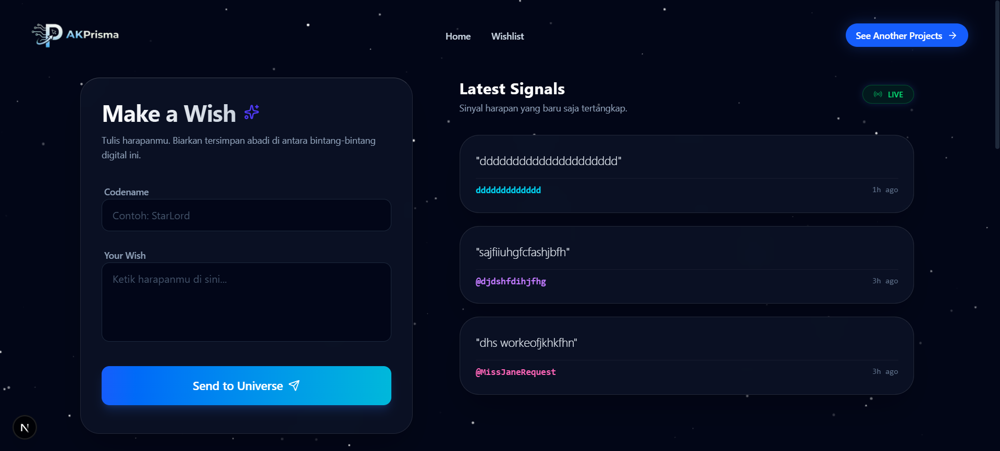

# 🌌 Space WishList - Galactic Transmission Logs



> An immersive, space-themed interactive application where users can send "wishes" to the universe. Built with **Next.js** and **Framer Motion**, featuring real-time filtering, smooth staggered animations, and a robust management system.

🔗 **Live Demo:** [https://space-wishlist-app.vercel.app/](https://space-wishlist-app.vercel.app/)

---

## 🛠️ Tech Stack

This project combines aesthetic design with solid engineering:

-   **Framework:** [Next.js 14/15 (App Router)](https://nextjs.org/)
-   **Language:** [TypeScript](https://www.typescriptlang.org/)
-   **Styling:** [Tailwind CSS](https://tailwindcss.com/)
-   **Animation:** [Framer Motion](https://www.framer.com/motion/)
-   **State Management:** React Context & Custom Hooks
-   **Icons:** [Lucide React](https://lucide.dev/) & [React Icons](https://react-icons.github.io/react-icons/)

---

## ✨ Key Features

-   **🚀 Interactive CRUD System:** Users can create, read, update, and delete their transmission logs (wishes) seamlessly.
-   **🔍 Real-Time Filtering:** Optimized search functionality that instantly filters wishes by message content or author name without layout shifting.
-   **🎭 Staggered Animations:** Beautiful entrance animations for grid items using `Framer Motion` variants.
-   **🧩 Clean Architecture:** Logic is strictly separated from UI using custom hooks (`useWishlistLogic`), making the code highly maintainable.
-   **🎨 Glassmorphism UI:** A modern, translucent design aesthetic set against a dynamic star background.
-   **📱 Layout Stability:** Engineered to prevent layout shifts (jumping) caused by scrollbars during filtering interactions.

---

## 📂 Project Structure

The project follows a modular structure to ensure scalability and separation of concerns:

```bash
root/
├── app/
│   ├── layout.tsx         # Root Layout
│   └── page.tsx           # Main Entry
├── components/
│   ├── wishlist/          # Core Components
│   │   ├── WishCard.tsx   # Individual Grid Item
│   │   ├── WishlistFilter.tsx
│   │   └── WishlistSection.tsx
│   ├── modals/            # Interactive Modals
│   │   ├── DeleteWishModal.tsx
│   │   └── UpdateWishModal.tsx
│   └── ui/                # Atomic Components
├── context/
│   └── WishlistContext.tsx # Global State Provider
├── hooks/
│   ├── useWishlistLogic.ts # Search, Pagination, Modal State
│   └── useCurrentTime.ts   # Time utility
└── lib/
    └── animations.ts       # Framer Motion Variants

```

---

## 🚀 Getting Started Locally

Follow these steps to explore the galaxy locally:

1. **Clone the repository**
```bash
git clone [https://github.com/ak7prisma/space-wishlist-app.git](https://github.com/ak7prisma/space-wishlist-app.git)
cd space-wishlist

```


2. **Install Dependencies**
```bash
npm install
# or
yarn install

```


3. **Run Development Server**
```bash
npm run dev

```


4. **Open in Browser**
Visit `http://localhost:3000` to launch the terminal.

---

## 🧠 Code Highlights

This project emphasizes **Separation of Concerns**. Complex logic is extracted from the UI components:

```typescript
// hooks/useWishlistLogic.ts
// Handles all state for Search, Pagination, and Modals
export const useWishlistLogic = (wishes, updateWish, deleteWish) => {
  // ... filtering logic
  // ... pagination logic
  // ... modal handlers
  return { search, visibleWishes, openModal, ... };
};

```

Animations are centralized to prevent prop drilling and clutter:

```typescript
// constants/animations.ts
export const cardVariants = {
  hidden: { opacity: 0, y: 20 },
  visible: (i) => ({ opacity: 1, y: 0, transition: { delay: i * 0.05 } })
};

```

---

## 📬 Contact / Command Center

If you'd like to collaborate or visit my main base of operations:

* **Command Center (Portfolio):** [Ahmad Kurnia Prisma](https://portofolio-ahmad-kurnia-prisma.vercel.app/)
* **Email:** ahmadkurniaprisma@gmail.com
* **LinkedIn:** [Ahmad Kurnia Prisma](https://www.google.com/search?q=https://www.linkedin.com/in/ahmad-kurnia-prisma-1b639a313)
* **Instagram:** [@akprisma](https://www.google.com/search?q=https://www.instagram.com/akprisma)

---

Developed by **Ahmad Kurnia Prisma**

```

```